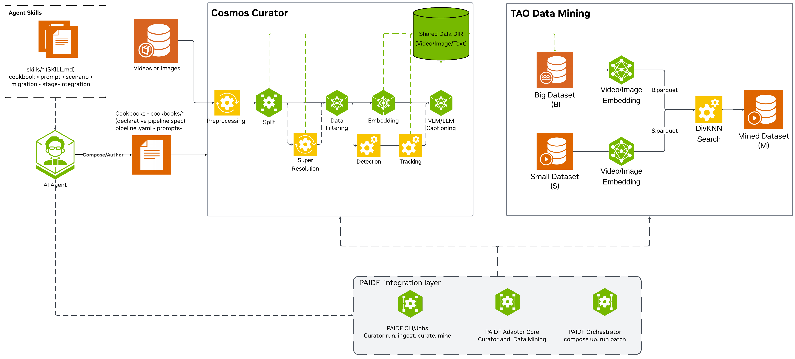

<!--
SPDX-FileCopyrightText: Copyright (c) 2026 NVIDIA CORPORATION & AFFILIATES. All rights reserved.
SPDX-License-Identifier: Apache-2.0
-->

# Physical AI Data Factory — Curation and Retrieval

**Product / repo:** `paidf-curation-and-retrieval` · **Version:** 1.1.0

## Overview

The Physical AI Data Factory (PAIDF) Curation and Retrieval workflow turns raw
video and image collections into training-ready datasets for physical AI. It
unifies two GPU-accelerated NVIDIA engines — **Cosmos Curator** for video and
image curation and **Data Mining** for embeddings and nearest-neighbor
retrieval — behind a single, reproducible operator interface.

Every capability is driven through **Make** targets backed by versioned
cookbook YAML and pinned runtime images, giving operators a consistent,
auditable contract from a laptop smoke test to scheduled, large-scale
orchestration — no second CLI to learn.

## What it does

- **Curate video/image** with Cosmos Curator: split, caption, classify, filter,
  SAM3 track-grounded event captioning, dedup, and WebDataset sharding, driven
  by per-stage cookbook YAML (`split` / `dedup` / `shard` / `image`).
- **Generate embeddings and mine**: CLIP/SigLIP image and text embeddings,
  then nearest-neighbor and unique-neighbor matching.
- **Hand off deterministically** from Curator embedding parquets (Cosmos-Embed1
  / InternVideo2) into Data Mining (Path C), with the model backend pinned on
  both sides.
- **Stay reproducible**: image tags pinned in the Makefile / `.env`, glue logic
  isolated in `packages/` `adapters/` `apps/`, and validated by offline unit
  tests (`uv run pytest tests/unit`).

Runnable domain recipes ship in [`cookbook/`](cookbook/README.md); the customer
guide lives in [`docs/user-guide/`](docs/user-guide/README.md).

## Engines and entry points

| Engine | Role | Entry points |
|--------|------|--------------|
| **Cosmos Curator** | Video / image curation | `make pull` · `make run-pipeline` · `make run_image_pipeline` |
| **Data Mining** | Image and text embeddings; nearest neighbors; unique neighbor matching | `make pull-data-mining` · `make run-image-embeddings` · `make run-text-embeddings` · `make run-data-mining-select` · `make run-data-mining-unique-match` |

Overall curation-and-retrieval architecture (Cosmos Curator + Data Mining):



---

## Documentation (start here)

Full customer guide:

**[docs/user-guide/README.md](docs/user-guide/README.md)** ·
**[CHANGELOG.md](CHANGELOG.md)**

| Need | Page |
|------|------|
| Getting Started | [Getting Started](docs/user-guide/getting-started.md) |
| Install and host requirements | [Installation](docs/user-guide/installation.md) |
| Sample clips and cookbooks | [Samples and Cookbooks](docs/user-guide/samples-and-cookbooks.md) |
| VLM / LLM endpoints | [VLM and LLM Endpoints](docs/user-guide/vlm-llm-endpoints.md) |
| Fix failures | [Troubleshooting](docs/user-guide/troubleshooting.md) |

Cookbooks: [`cookbook/README.md`](cookbook/README.md).

---

## Access

Before clone or the first `docker pull`:

- NGC login (`docker login nvcr.io`) for Cosmos Curator
- Entitlement to pull TAO Data Services from NGC
  (`nvcr.io/nvidia/tao/tao-toolkit:7.2.0-data-services`;
  see [Installation](docs/user-guide/installation.md))

```bash
git clone https://github.com/NVIDIA/paidf-curation-and-retrieval.git
cd paidf-curation-and-retrieval
cp .env.example .env
uv sync --extra dev
docker login nvcr.io
```

---

## Quick Start

Public UX is **Make-only**. Pick the path that matches your goal:

- **Path A — Cosmos Curator**: curate video/image (the primary engine).
  Needs GPU, FFmpeg, and Curator models (hours on first run).
- **Path B — Data Mining**: embeddings and nearest-neighbor
  retrieval only. No Curator models — the fastest way to see a result.
- **Path C — Curation + Mining**: curate first, then mine the embeddings.

Details: [Getting Started](docs/user-guide/getting-started.md).

### Path A — Cosmos Curator

Needs GPU, FFmpeg sidecar, and Curator models (`MODELS_DIR`). First model
download is large (~90GB). Sample MP4s are **not** in this repository: download
NGC `nvidia/vss-developer/dev-profile-sample-data:3.2.0` and copy traffic /
warehouse clips into `cookbook/*/videos/` first. Steps:
[Samples and Cookbooks](docs/user-guide/samples-and-cookbooks.md). First-run
uses the **minimal** split cookbook on the traffic smoke clip (split +
Cosmos-Embed1 only). Kitchen-sink caption/SAM3/classifier:
`cookbook/traffic-video-analytics/split.yaml` after
[VLM and LLM Endpoints](docs/user-guide/vlm-llm-endpoints.md).

```bash
make pull
make ffmpeg-install
make check-setup
make download-models MODELS_DIR=/path/to/models

make run-pipeline \
  CONFIG_FILE=cookbook/traffic-video-analytics/split-minimal.yaml \
  DATA_DIR=$PWD/cookbook/traffic-video-analytics \
  MODELS_DIR=/path/to/models \
  FFMPEG_DIR=$HOME/cosmos-curator-ffmpeg
```

The command above uses the default `MODEL_LIST` (Path A traffic). Warehouse
InternVideo2, OCR, shard, and SeedVR2 need extra tokens; see
[Operations: Curator](docs/user-guide/operations-curator.md#models).

**Success:** `cookbook/traffic-video-analytics/output/split-minimal/ce1_embd_224p_parquet/`
exists.

### Path B — Data Mining

No Curator models required. The mining image provides both image/text
embeddings and nearest-neighbor mining. This example embeds
one query image and two candidate images with CLIP, then mines the nearest
candidate.

| File | Role |
|------|------|
| `S.parquet` | Targets (queries): find neighbors **for** these rows |
| `B.parquet` | Candidates (pool): search **in** these rows |

Copy any three JPEGs into the working directory and keep the
`images/*.jpg` names below (used by the JSON manifests).

```bash
make pull-data-mining
make check-data-mining-image

mkdir -p data/tao-mine/images
cp /path/to/query.jpg      data/tao-mine/images/query.jpg
cp /path/to/candidate-1.jpg data/tao-mine/images/candidate-1.jpg
cp /path/to/candidate-2.jpg data/tao-mine/images/candidate-2.jpg

printf '%s\n' '[{"filepath":"images/query.jpg"}]' \
  > data/tao-mine/S.json
printf '%s\n' \
  '[{"filepath":"images/candidate-1.jpg"},{"filepath":"images/candidate-2.jpg"}]' \
  > data/tao-mine/B.json
```

Build the two TAO input manifests and generate embeddings with the same model:

```bash
make image-embeddings-build \
  DATA_DIR=$PWD/data/tao-mine \
  IMAGE_EMBEDDING_JSON=$PWD/data/tao-mine/S.json \
  IMAGE_EMBEDDING_INPUT=$PWD/data/tao-mine/S-input.parquet
make run-image-embeddings \
  DATA_DIR=$PWD/data/tao-mine \
  IMAGE_EMBEDDING_INPUT=$PWD/data/tao-mine/S-input.parquet \
  IMAGE_EMBEDDING_OUTPUT=$PWD/data/tao-mine/S.parquet \
  IMAGE_EMBEDDING_MODEL_TYPE=clip \
  IMAGE_EMBEDDING_MODEL=openai/clip-vit-base-patch32

make image-embeddings-build \
  DATA_DIR=$PWD/data/tao-mine \
  IMAGE_EMBEDDING_JSON=$PWD/data/tao-mine/B.json \
  IMAGE_EMBEDDING_INPUT=$PWD/data/tao-mine/B-input.parquet
make run-image-embeddings \
  DATA_DIR=$PWD/data/tao-mine \
  IMAGE_EMBEDDING_INPUT=$PWD/data/tao-mine/B-input.parquet \
  IMAGE_EMBEDDING_OUTPUT=$PWD/data/tao-mine/B.parquet \
  IMAGE_EMBEDDING_MODEL_TYPE=clip \
  IMAGE_EMBEDDING_MODEL=openai/clip-vit-base-patch32
```

Mine B for the nearest neighbor of each S row:

```bash
make run-data-mining-select \
  DATA_DIR=$PWD/data/tao-mine \
  TARGET_SUBDIR=S.parquet \
  SOURCE_SUBDIR=B.parquet \
  TOPN=1 \
  TDM_EMBEDDING_BACKEND=clip \
  OUTPUT_SUBDIR=out
```

**Success:** `data/tao-mine/out/mined.parquet` exists.

### Path C — Curation + Mining

Curator **does** generate video embedding parquets (IV2 / CE1). It does
**not** emit TMM’s `S.parquet` / `B.parquet` names—those are a mining
layout you stage from Curator’s embedding output.

1. **Run Path A** with embeddings on (`generate_embeddings: true`,
   `embedding_algorithm: "cosmos-embed1-224p"`; warehouse cookbook still
   uses `"internvideo2"`). Fill the cookbook’s split output path
   (`output_clip_path` / placeholder). Curator writes embedding parquet(s)
   below it in `ce1_embd*_parquet/` or `iv2_embd_parquet/`.

2. **Stage for TMM.** Same model and vector dimension on both sides:
   - **S** = query clips (neighbors **for** these)
   - **B** = candidate pool (search **in** these)

   Typical pattern: one Curator embedding parquet (or a row subset) as S,
   another (or the full set) as B:

```bash
mkdir -p data/curated-mine
# Paths below are Curator embedding parquet outputs from Path A
cp /path/to/curator_query_embeddings.parquet data/curated-mine/S.parquet
cp /path/to/curator_pool_embeddings.parquet  data/curated-mine/B.parquet
```

3. **Mine** with the backend that matches the Curator producer:

```bash
make run-data-mining-select \
  DATA_DIR=$PWD/data/curated-mine \
  TARGET_SUBDIR=S.parquet \
  SOURCE_SUBDIR=B.parquet \
  TOPN=5 \
  TDM_EMBEDDING_BACKEND=ce1 \
  OUTPUT_SUBDIR=out
```

Use `TDM_EMBEDDING_BACKEND=iv2` when Curator used InternVideo2 (warehouse).

**Success:** `data/curated-mine/out/mined.parquet` exists. More detail:
[Getting Started](docs/user-guide/getting-started.md).

---

## System Requirements (summary)

| Component | Minimum |
|-----------|---------|
| **GPU** | NVIDIA A40 / A100 / H100 class (48GB+ VRAM for full Curator) |
| **CPU** | 16+ cores |
| **RAM** | 64GB |
| **Storage** | 500GB SSD (+ ~90GB for Curator models) |
| **OS** | Ubuntu 22.04 / 24.04 LTS |
| **Software** | Docker 20.10+, NVIDIA Container Toolkit, `uv`, Python 3.10–3.12 |

TAO Data Services (default pin `7.2.0-data-services`) documents driver
floor `595.45.04`. Curator has separate image/GPU compatibility requirements;
qualify the selected Curator image independently. Full matrix:
[Installation](docs/user-guide/installation.md).

---

## Project structure

```text
paidf-curation-and-retrieval/
├── .env.example            Image pin template
├── adapters/               Curator, Data Mining, and Docker integration
├── apps/                   Internal glue helpers (invoked by Make)
├── packages/               Domain types, ports, analytics
├── configs/                Full Curator reference YAMLs
├── cookbook/               Domain recipes (Curator + TMM)
├── docs/user-guide/        Customer documentation
├── docs/developer/         Contributor architecture notes
├── docs/assets/            Architecture diagrams
├── docs/architecture/      Contributor architecture notes
├── skills/                 Agent skill for operator workflows
├── tests/unit/             Glue unit tests (no live GPU required)
├── Makefile                Operator UX
└── pyproject.toml          uv project (version 1.1.0)
```

---

## Agent skills

| Skill | Scope |
|-------|--------|
| `curation-and-retrieval` | Cosmos Curator configs, cookbooks, Data Mining handoffs |

Customer guide: [docs/user-guide/](docs/user-guide/).

---

## Development

This project is currently not accepting contributions.
See [CONTRIBUTING.md](CONTRIBUTING.md).

```bash
uv sync --extra dev
uv run ruff check .
uv run ruff format .
uv run pytest tests/unit -q
```

Internal development uses conventional commits (`feat:`, `fix:`, `chore:`,
`docs:`). Never commit secrets, `local.env`, or private registry hosts.

---

## Responsible Use of AI Models

[Responsible Use](./RESPONSIBLE_USE.md)

---

## Notice

**NOTICE AND DISCLAIMER:** This software automatically retrieves, accesses or
interacts with external materials. Those retrieved materials are not
distributed with this software and are governed solely by separate terms,
conditions and licenses. You are solely responsible for finding, reviewing and
complying with all applicable terms, conditions, and licenses, and for
verifying the security, integrity and suitability of any retrieved materials
for your specific use case. This software is provided "AS IS", without
warranty of any kind. The author makes no representations or warranties
regarding any retrieved materials, and assumes no liability for any losses,
damages, liabilities or legal consequences from your use or inability to use
this software or any retrieved materials. Use this software and the retrieved
materials at your own risk.
