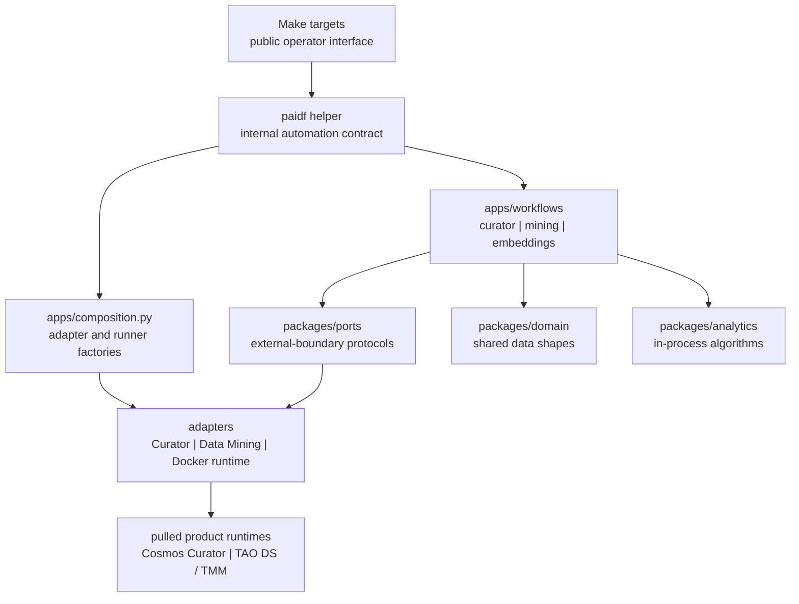
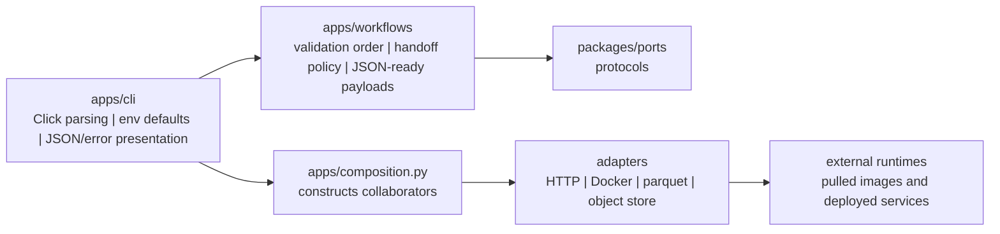

```mermaid
flowchart TB
  make["Make targets\npublic operator interface"]
  paidf["paidf helper\ninternal automation contract"]
  composition["apps/composition.py\nadapter and runner factories"]
  workflows["apps/workflows\ncurator | mining | embeddings"]
  ports["packages/ports\nexternal-boundary protocols"]
  domain["packages/domain\nshared data shapes"]
  analytics["packages/analytics\nin-process algorithms"]
  adapters["adapters\nCurator | Data Mining | Docker runtime"]
  runtimes["pulled product runtimes\nCosmos Curator | TAO DS / TMM"]

  make --> paidf
  paidf --> composition
  paidf --> workflows
  composition --> adapters
  workflows --> ports
  workflows --> domain
  workflows --> analytics
  ports --> adapters
  adapters --> runtimes
```

```mermaid
flowchart LR
  cli["apps/cli\nClick parsing | env defaults | JSON/error presentation"]
  workflow["apps/workflows\nvalidation order | handoff policy | JSON-ready payloads"]
  compose["apps/composition.py\nconstructs collaborators"]
  port["packages/ports\nprotocols"]
  adapter["adapters\nHTTP | Docker | parquet | object store"]
  runtime["external runtimes\npulled images and deployed services"]

  cli --> workflow
  cli --> compose
  workflow --> port
  compose --> adapter
  adapter --> runtime
```
