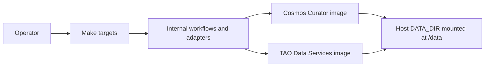
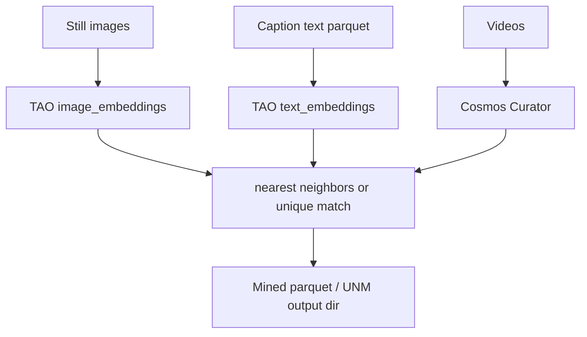

<!--
SPDX-FileCopyrightText: Copyright (c) 2026 NVIDIA CORPORATION & AFFILIATES. All rights reserved.
SPDX-License-Identifier: Apache-2.0
-->

# Architecture

## System at a glance

Overall **Physical AI Data Factory — Curation and Retrieval** architecture
(Cosmos Curator and Data Mining):


Cosmos Curator video/image curation pipeline only (split, caption, embed,
dedup, shard):


Operator and glue layers:



| Layer | Role |
|-------|------|
| **Make** | Public interface (`make help`) |
| **apps/workflows** | Validation order, handoff policy, JSON-ready results |
| **adapters** | Docker argument construction, parquet prep, path mounts |
| **Pulled images** | Cosmos Curator; TAO Toolkit Data Services (`embedding`, `tmm`) |

There is no shared scheduler or cross-step state in this repository. Sequence
Make targets yourself or from an external orchestrator.

Clean-architecture detail:
[paidf-clean-architecture.md](../architecture/paidf-clean-architecture.md).

## Product engines

| Engine | Generates embeddings? | Mining? | Typical Make entry |
|--------|----------------------|---------|-------------------|
| Cosmos Curator | Yes (IV2, CE1, image annotate) | No | `make run-pipeline`, `make run_image_pipeline` |
| TAO `embedding` | Yes (image and text) | No | `make run-image-embeddings`, `make run-text-embeddings` |
| TAO `tmm` | No | Yes (NN and UNM) | `make run-data-mining-select`, `make run-data-mining-unique-match` |

TMM **consumes** precomputed embeddings. It does not generate them.

## Data flow



Declare the producer family when mining with:

```text
TDM_EMBEDDING_BACKEND=iv2|ce1|clip|siglip
```

Vector values alone cannot prove their producer family. Compatibility checks
use the declared backend.

## S and B (target and source)

| Symbol | Name | Role |
|--------|------|------|
| **S** | Target / query set | Items you want matches **for** |
| **B** | Source / candidate pool | Items you search **in** |

Typical layout under `DATA_DIR`:

```text
data/nearest-neighbor-mining/
  S.parquet    # targets
  B.parquet    # candidates
```

Each parquet must provide filepath-like identity (`filepath` or `file_name`,
or a custom column name you declare) and an embedding vector column (default
`embedding`, or a custom name you declare).

### Nearest neighbors outcome

For each S row, return up to `TOPN` closest B rows under the chosen metric,
optionally filtered by `DISTANCE_THRESHOLD` and `FILTER_BY_LABEL`.

### Unique neighbor matching outcome

Greedy unique assignment: selected B items are not reused across S demands
beyond the allocation policy. Output directory contains
`final_unique_files.parquet` after a successful live run, and often
`summary.json`.

| Policy | Extra inputs |
|--------|--------------|
| `global` | None beyond S/B and count/metric knobs |
| `class_stratified` | Detection files, `DETECTION_FORMAT=coco\|kitti`, `RARE_CLASS_LIST` |

Detection shapes:

- `coco` — single COCO JSON **file**
- `kitti` — **directory** of per-image `.txt` label files

## Experiment specs

Every TAO Data Services `embedding` and `tmm` run requires
`-e/--experiment_spec_file`.

- Cookbook YAML (`TMM_CONFIG_FILE`, `TMM_UNM_CONFIG_FILE`,
  `IMAGE_EMBEDDING_CONFIG`, `TEXT_EMBEDDING_CONFIG`) is mounted read-only.
- Direct Make variables are validated and written to a temporary read-only
  spec.

## Cosmos Dataset Search

CDS deployment and retrieval are out of scope for this product path. Curator
CE1/IV2 and TAO CLIP/SigLIP embeddings are used here for TMM handoffs.
